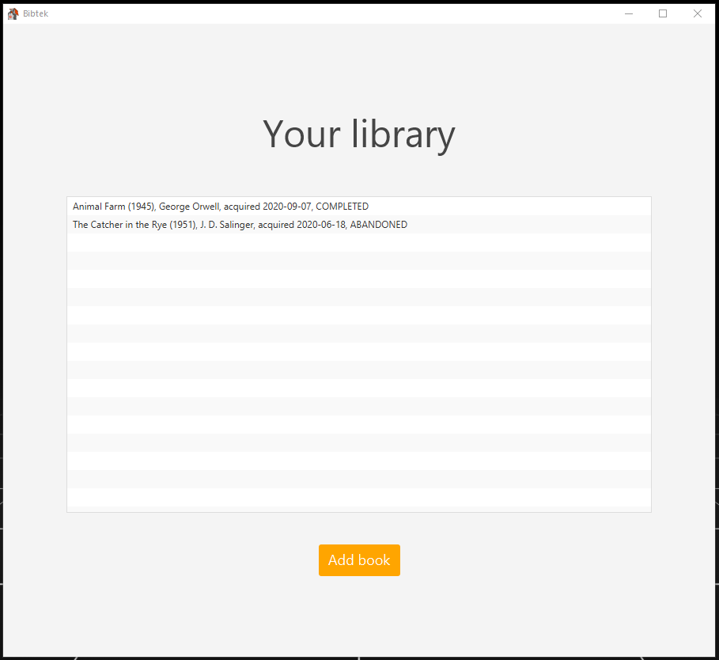

# Bibtek

Bibtek is a home library management application, aiming to simplify user's reading list. Built with JavaFX with Maven, Bibtek is great for desktop use. Project files can be found in the [**/biktek/**](/bibtek) folder.

## Description

Biktek will support a number of features once complete (User Stories):
- A reader shall be able to register books they have read, and give them a rating.
- A reader's profile and library shall be saved in a backend database to create persistent storage.
- A reader can view the books they have read, (their library) and (possibly) look at other readers profiles to see what they have read.
- (Maybe) A reader shall be able to add a book to their library by entering the ISBN code of the book.

## Building and running the app
The project utilizes maven for building and running.

Before running the app, it needs to be built.

1. Building is done with `mvn install` from the app's root folder [**/bibtek/**](/bibtek)

2. Running the app is done through the fxui module with the command `mvn javafx:run -f fxui`

## Screenshot

